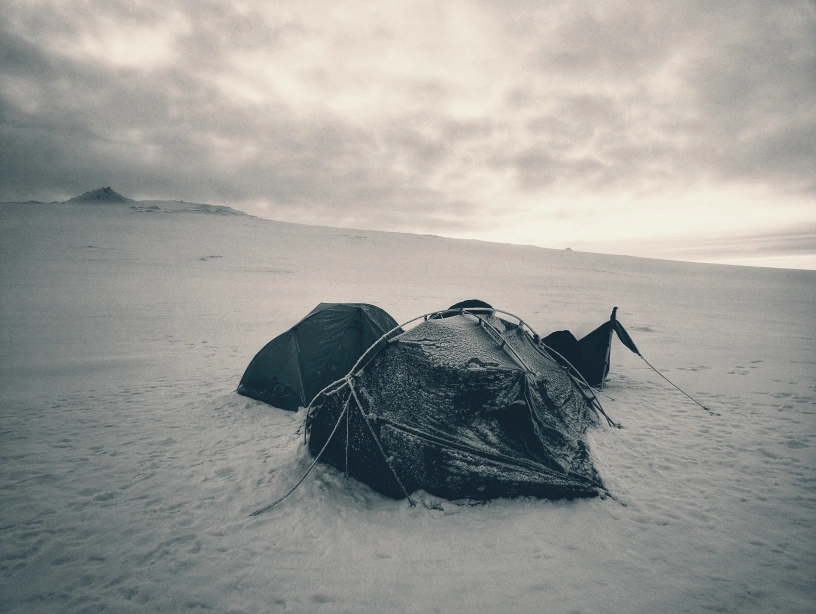

+++
title = "Hannes Hauswedell's homepage"
+++

<!-- 
 -->

<!--  -->
<!-- 
 -->

I am a software engineer and bioinformatician who loves Modern C++, clean code and optimisation.
I somehow managed to get a doctorate from Freie Universität Berlin and ended up representing Iceland at WG21 (the ISO C++ committee).
In the past I have also taught programming at university, briefly worked as a consultant and even earlier as a UNIX system administrator.

I [blog](/post) (very) irregularly about various tech topics.

You can find me on several platforms (see the icons on the left) or [write me an e-mail](mailto:h2{æð}fsfe{.}org).
