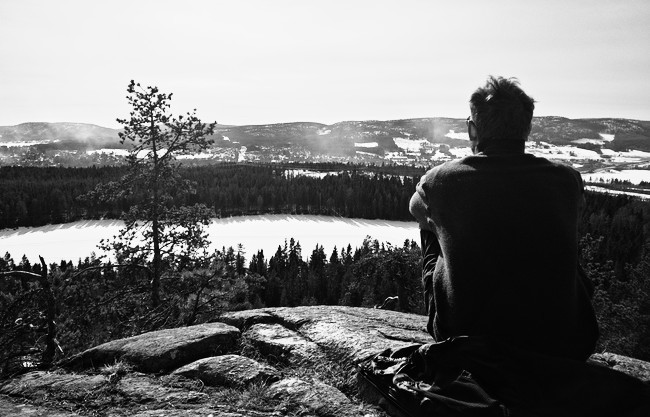

+++
title = "Hannes Hauswedell's homepage"
+++

<!--  -->

Current occupations:

  * Teaching and research assistant at [Freie Universität Berlin](http://www.mi.fu-berlin.de/en/inf/groups/abi/members/Scientific_Staff/hauswedell.html)
  * Lead developer of [SeqAn](https://www.seqan.de), the C++ library for biological sequence analysis
  * Author and developer of [Lambda](https://www.seqan.de/lambda), a protein similarity search tool
  * Maintainer of a few [FreeBSD packages](http://www.freshports.org/search.php?stype=maintainer&method=exact&query=h2%2Bfbsdports@fsfe.org)
  * more or less active on: [GitHub](https://github.com/h-2), [twitter](https://twitter.com/__h2__), [mastodon](https://mastodon.social/@__h2__), [ResearchGate](https://www.researchgate.net/profile/Hannes_Hauswedell)

In the past I have also worked as a bioinformatics and C++ consultant and even earlier as a UNIX system adminstrator.

I [blog](/post) irregularly about different tech topics.
